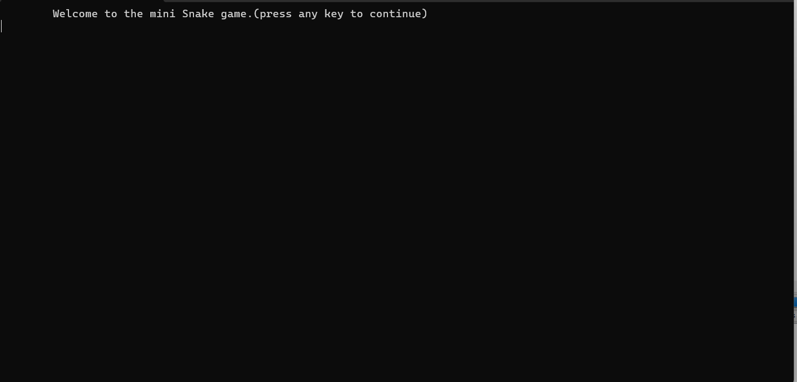
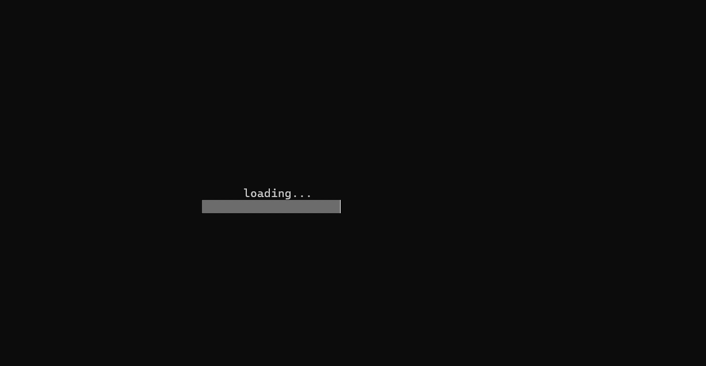
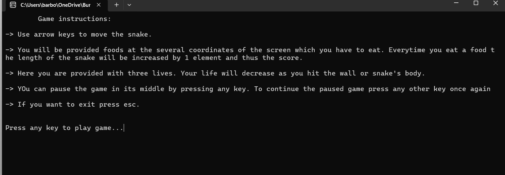
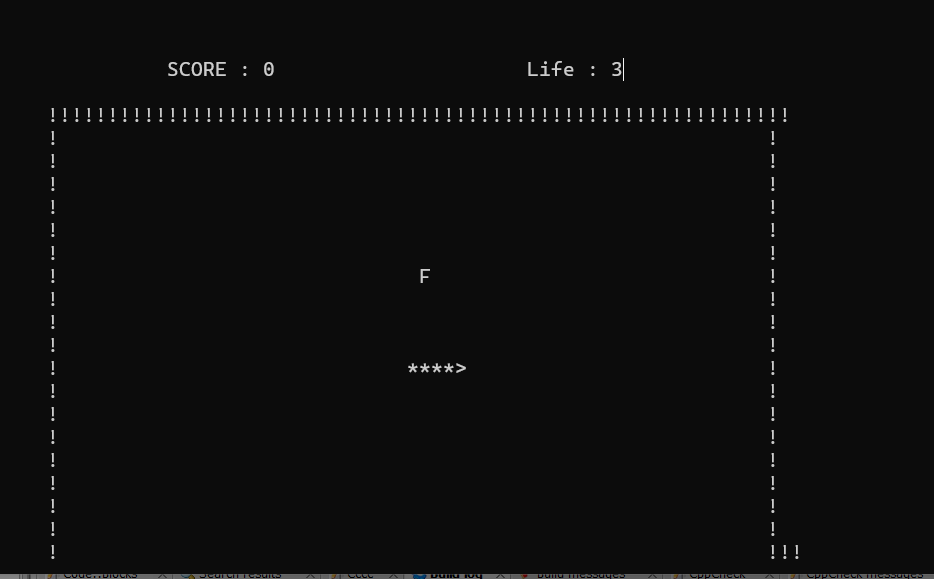
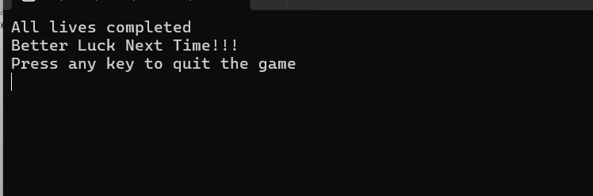

# 🐍 Snake Game - C

[](https://www.gnu.org/software/gcc/)
[](LICENSE)

## Game

  
_Initial screen before starting the game_

  
_Loading screen between levels or after game start_

  
_Main menu screen_

  
_During gameplay_

  
_Game over screen showing final score_


## Description

A classic Snake game developed in C as an academic project.  
The game runs in the Windows console and uses keyboard inputs to control the snake's movement. Players collect food, grow the snake, and earn points while avoiding collisions.

This project demonstrates:

- Console input/output
- Arrays and control structures
- Game logic with collision detection
- File handling for score recording
- Menu-driven interface

## Features

- Snake movement using arrow keys  
- Random food generation  
- Snake growth after eating food  
- Score calculation based on snake length  
- Multiple lives system  
- Collision detection (walls and snake body)  
- Game over handling  
- Score recording system with a local text file (`record.txt`)  
- Interactive menu: Start, View High Score, Reset Score, Help, Quit  

## Controls

- **Arrow Keys:** Move the snake  
- **ESC:** Exit the game  

## Score Storage

The game stores player names and scores in a local text file (`record.txt`) using file input/output operations in C.  
This allows keeping a history of previous game sessions and tracking the highest score.

## Technologies

- C programming language  
- Windows Console API  
- Standard C libraries  

## How to Run

1. Compile the program using a C compiler (e.g., GCC or Code::Blocks):  
   ```bash
   gcc snakegame.c -o snakegame
